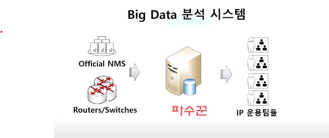
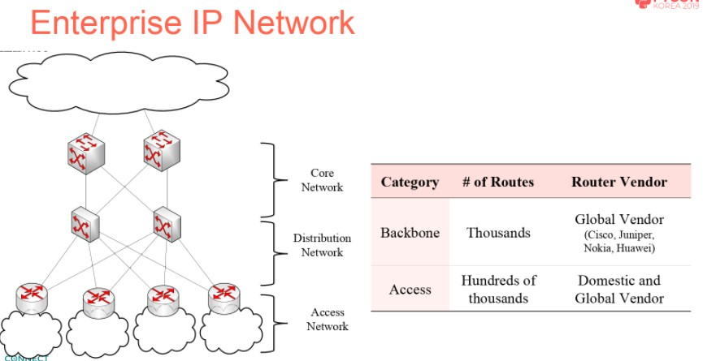

# PyCon 2019 후기
## 엔터프라이즈급 네트워크 운용 관리
- 
- 
- 백본 네트워크 상에서 데이터와 파이썬
- 데이터 수집 : Non Real Time(SSH/telnet+ssh)
    - paramiko의 exec_command와 invoke_shell : Router Vendor마다 지원하는 함수가 다름
- Redundancy check for access network routers
    - Routing Table의 Loopback 주소를 조회
- OSPF cost change history tracking
    - Cost 파일을 open 하여 조회
- 데이터 리포팅 : Realtime Server(Web with Django) / Non-Realtime(SMTP)

## 시간 복잡도로 살펴보는 파이썬 내장 자료형의 효율적인 활용
- mutable datatype : tuple
    - tuple concat의 내부 C 코드 확인 (how?)
    - 즉, O(N+M)으로 계산됨
- immutable datatype : list
    - list concat의 내부 C 코드 확인
    - Resize를 안할 경우 O(M), Resize를 할 경우 O(N+M)
- list pop
    - memmove()함수를 통한 리스트 호출
    - O(N)
- list append
    - append를 할 경우, 할당된 여유 메모리가 있으면 그냥 append, 아닐 경우 개로 메모리를 할당하고 append
    - Resize를 안할 경우 O(1), Resize 할 경우 O(N)
    - 해결법 : 메모리 미리 할당([0]*N)
- mutable datatype : dict
    - 조회는 O(1)
- dic insert
    - bucket size의 2/3만큼 찰 경우 2배로 Resize
    - 메모리 증설 -> 기존 bucket 데이터 복사
    - 해결 : 메모리 미리 할당
- 파이썬 C 코드 확인 방법
    - CPython [Github](https://github.com/python/cpython)

## Pickle & Custom Binary Seriallizer
- Seriallization/De-seriallization
    - 데이터를 01010100의 ByteStream으로 바꾸는 것이 Seriallization
- Pickle : 파이썬 전용 Seriallization
    - 장점 : Python 객체들과 호환됨
    - dump/dumps/load/loads

## Advanced Python testing techniques
- TDD개념
    - 테스트 케이스를 먼저 짜라(당연히 머리로 짜야된다)
    - 그 이후에 코드를 짜라
    - 하기 싫어지는 이유 : 코드 없이 테케를 머리로 짜야되는데, 당연히 쉽지 않음
- (내 생각) 절충된 TDD
    - 코드부터 짜도 상관은 없다
    - 대신, 이후에 테스트 자동화가 쉬워지는 구조를 염두에 두고 짜라 
- Python Test 라이브러리
    - unittest : 기본적인 테스트 라이브러리
    - pytest : 개선된 테스트 라이브러리
- Fixture
- API 테스트 예시
    - 방식 : 
    1. 테스트 시나리오를 짠 후
    2. API에 시나리오에 맞게 REQ
    3. 각 REQ별 RES STATUS를 보고 결과 판정
    - 테스트 시나리오가 복잡해질수록 쉽지 않음
- Python Sure 라이브러리 통한 테스트 코드의 구조화
    - 용도 : assertion을 가독성 좋게 만들어주는 라이브러리
    - sure를 다시 래핑해서 더 가독성 좋은 코드를 짤 수도 있음
- BDD(Behavior Driven Development)
    - 자연어를 통해 테스트 코드를 작성 가능
    - 가능하면 재사용 가능한 문장으로 사용
- Python BDD 라이브러리
    - pytest-bdd
- Parametrized BDD
    - 치환변수 등으로 바꿀 수 있는 부분을 parameter로 만들어서 테스트
- HTTP Mocking 라이블러 HTTPretty
    - 용도 : 외부 서비스 등의 dependency가 존재하는 테스트 수행할 경우 사용
- Monkey Patching
    - 런타임에 특정 클래스나 모듈의 attribute를 강제로 바꿈(오버라이딩)
    - 테스트하고자 하는 모듈의 특정 함수를 원하는대로 바꿔서, 원하는 테스트환경을 만들어내는데 사용
- Randomized Testing
    - 임의의 input이 들어가더라도, 반드시 지켜져야 하는 공통의 output 규칙(예시 : 제곱함수는 반드시 >=0 반환) 테스트

## 실시간 의료 인공지능 데이터 처리를 위한 Django Query Optimization
- 병목파악
    1. 병원 API -> 서비스 DB 간 저장시 상당시간 소요
    2. DB -> ML모델 -> DB간 데이터 플로우가 매분마다 수행되어야 함
- Django ORM Query Profiling
    - 실제 Query를 보고 싶다 : python command 사용
    - 프로파일링 툴 : Django-debug-toolbar/Silk
- 

---

## Lightning Talk : 크고 깊은 곳으로의 탐험
- DarkWeb에 접근한 후기
- 기존 방법 : Tor 브라우저를 통한 Anounimizing
- 시도 : Python Selenium 이용한 접근
- 다크웹 사이트의 비트코인 흐름 추적

## Lightning Talk : 왜 사람들은 회사 냉장고에 음식을 넣을 때 스티커를 안 붙이는가?
- 총무업무 = UX 디자인
- 사용자가 하던 걸 바꾸지 않고 새로운 걸 하게 만드는 것
    - 사용자는 매우매우매우 게으르다
    - 핵심은 비효율의 제거
- 음식의 소유자/보관기간/ 작성 스티커
    - 아무도 안함
- 라벨프린터/라즈베리파이/NFC
    - 출입카드를 찍으면 스티커가 출력된다!

## Lightning Talk : 쿠버네티스에 개들을 풀어라
- 쿠버네티스에 데이터 모니터링 시스템(Datadog) 적용기
- Python을 이용한 모니터링 모듈 작성
- 파이썬의 내장 http 모듈이, 미니멀한 모니터링 작업에 너무나도 유용하다

## Lightning Talk : 테스트 미신
- **테스트 그거 짜는데 오래 걸려**
- 이유 : 손으로 그냥 python app.py 하면 되니까
- 그러나 : 코드는 녹이 슨다
    - 라이브러리가 업데이트 된다
    - 개발환경이 변경된다
    - 팀원들이 많아지고, 자주 바뀐다
- TDD에 대한 올바른 개념 : 구현을 하고 테스트를 짜는게 아니라, 테스트를 먼저 짜고 거기에 맞게 구현을 짜라